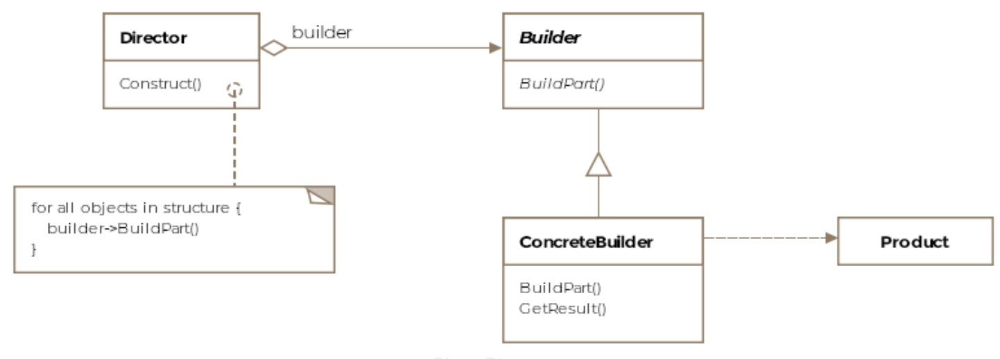

# Builder Pattern

## What is it?
As the name implies, a builder pattern is used to build objects. Sometimes, the objects we create can be complex, made up of several sub-objects or require an elaborate construction process. The exercise of creating complex types can be simplified by using the builder pattern. A *composite* or an *aggregate* object is what a builder generally builds.

Formally, a **builder pattern encapsulates or hides the process of building a complex object and separates the representation of the object and its construction. The separation allows us to construct different representations using the same construction process.** In Java speak, different representations implies creating objects of different classes that may share the same construction process.


## Class Diagram
The class diagram consists of the following entities
* **Builder**
* **Concrete**
* **Director**
* **Product**

<p align="center">
    
</p>

## Example
With an example of airplanes, let's say the construction of an aircraft involves the three steps in order:

1. the making of the cockpit
2. then the engine
3. and finally the wings

In our hypothetical world, every aircraft requires at least the above three steps. However, a passenger aircraft can have an added step of making bathrooms in the plane. The steps represent the **construction** process from our formal definition. The **product** is an aircraft but can have different **representations** such as an F-16 or a Boeing-747. Using the same construction process, we should be able to produce both F-16s and Boeings.

Let's see some code now. First we'll start with the abstract interface for our `AircraftBuilder` class. The builder contains a method for each component that can be part of the final product. These methods are selectively overridden by concrete builders depending on if the builders will be including that part in the final product variant that they are responsible for building.

```java
public abstract class AircraftBuilder {
    public void buildEngine() {

    }

    public void buildWings() {

    }

    public void buildCockpit() {
        
    }

    public void buildBathrooms() {

    }

    abstract public IAircraft getResult();
}
```


Now we'll implement two concrete builders, one for F-16 and one for Boeing-747.

```java
public class Boeing747Builder extends AircraftBuilder {
    Boeing747 boeing747;

    @Overrid
    public void buildCockpit() {

    }

    @Override
    public void buildEngine() {

    }

    @Override
    public void buildBathrooms() {
        
    }

    @Override
    public void buildWings() {

    }

    public IAircraft getResult() {
        return boeing747;
    }
}


public class F16Builder extends AircraftBuilder {
    F16 f16;

    @Override
    public void buildEngine() {
        // get F-16 an engine
        // f16.engine = new F16Engine();
    }

    @Override
    public void buildWings() {
        // get F-16 wings
        // f16.wings = new F16Wings();
    }

    @Override
    public void buildCockpit() {
        f16 = new F16();
        // get F-16 a cockpit
        // f16.cockpit = new F16Cockpit();
    }

    public IAircraft getResult() {
        return f16;
    }
}
```


For brevity's sake, we have provided the skeleton of the builders and skipped individual implementation of each method. Note the `F16Builder` doesn't override the `buildBathrooms` method, since there are no bathrooms in the F-16 cockpit. The Boeing's builder does override the bathroom's method since a Boeing-747 has bathrooms for passengers.

The process or algorithm required to construct the aircraft which in our case is the specific order in which the different parts are created is captured by another class called the `Director`. The director is in a sense **directing** the construction of the aircraft. The final product is still returned by the builders.

```java
public class Director {

    AirCraftBuilder aircraftBuilder;

    public Director(AirCraftBuilder aircraftBuilder) {
        this.aircraftBuilder = aircraftBuilder;
    }

    public void construct(boolean isPassenger) {
        aircraftBuilder.buildCockpit();
        aircraftBuilder.buildEngine();
        aircraftBuilder.buildWings();

        if (isPassenger)
            aircraftBuilder.buildBathrooms();
    }
}
```


Notice how we can pass in the builder of our choice, and vary the *aircraft product* (representation) to be either an F-16 or a Boeing-747. In our scenario, the builders return the same supertype however that may not be the case if the builders return products that aren't very similar.

The client will consume the pattern like so:

```java
public class Client {

    public void main() {

        F16Builder f16Builder = new F16Builder();
        Director director = new Director(f16Builder);
        director.construct(false);

        IAircraft f16 = f16Builder.getResult();
    }
}
```


## Skipping the Director
You may find the builder pattern being used without the **director**. The client can directly instantiate the builder and invoke the required methods to get a product for itself. This is a common antidote for *telescoping constructors*. Imagine a class with too many attributes but some attributes are to be set optionally. In such a case the builder can be invoked to only set the required attributes and create a product.


## Other Examples
* The Jave api exposes a `StringBuilder` class that doesn't really conform to the strict reading of the GoF builder pattern but can still be thought of as an example of it. Using the `StringBuilder` instance we can successively create a string by using the append method.
* Another hypothetical example could be creating documents of type pdf or html. Consider the snippet below:

```java
public IDocument construct(DocumentBuilder documentBuilder) {

        documentBuilder.addTitle("Why use design patterns");
        documentBuilder.addBody("blah blah blah... more blah blah blah");
        documentBuilder.addAuthor("C. H. Afzal");
        documentBuilder.addConclusion("Happy Coding!");
        
        // Return the document and depending on the concrete
        // implementation of the DocumentBuilder, we could return
        // either a pdf or html document.
        return documentBuilder.buildDocument();
        
    }
```

The above method can appear in a director or client code and different document types can be built by varying the concrete type of the DocumentBuilder passed into the method. We could have a `HtmlDocumentBuilder` and a `PdfDocumentBuilder` derive from the abstract class `DocumentBuilder`.


## Caveats
The builder pattern might seem similar to the abstract factory pattern but one difference is that the builder pattern creates an object step by step whereas the abstract factory pattern returns the object in one go.